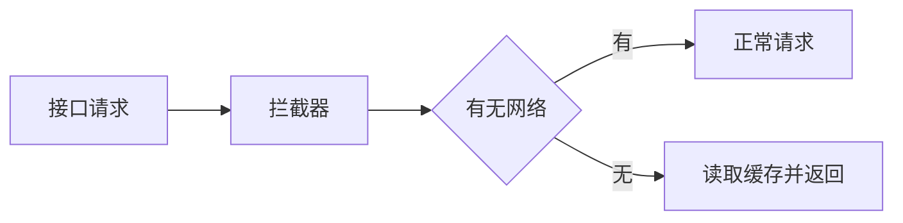

## 上次回顾
---
上次通过注解加拦截器实现了接口数据缓存的自管理，只需在要缓存的接口上添加自定义注解，即可在自定义的拦截器中实现对接口数据的存储和读取。后面使用起来也不错，但是用着用着，会发现有几个问题，其实可以看出，这里缓存的存储和读取依赖于接口请求，因为对缓存的处理是在网络拦截器中进行的，这意味着如果你想使用缓存就必须得发起接口请求，这对缓存的存储来说一点毛病没有，毕竟我存储的数据就是从网络获取来的，但是对缓存的读取使用来说，某些情况下就有点问题了，起先我们对缓存的读取使用这么个流程：

## 缓存读取流程
---

## 依赖接口请求的弊端
---
如果想要使用缓存，必须满足两个条件，一是发起接口请求，二是手机没有网络，正常情况下这两个条件一点毛病没有，你发起请求，有网我给你正常走流程，没网我读取缓存返回给你使用，但是，就怕但是，某些情况，比如我想在不请求接口的情况下还使用该接口的缓存，怎么办？再一个，我发起了接口请求，但是此时网络比较慢，或者接口数据比较复杂庞大，从服务器传递到手机的时间比较长，而我们的页面可能又依赖这些数据进行展示，所以在数据传递完成到我们的手机上之前，页面可能白屏（没有数据展示）时间过长，这对与用户的体验来讲非常的不好，我们希望用户可以非常快的就能看到有数据的界面。

## 针对弊端做出优化
---
针对这两种情况，怎么解决呢？

第一种：
	既然想在不请求接口的情况下使用缓存，那我就直接给你呗，反正缓存都在本地存着，只要拿到对应接口的缓存再给你就行了。

第二种：
	既然数据传递时间过长，那我就不等接口返回了，直接拿到对应接口存储在本地的缓存，设置给页面UI进行展示，不就结了吗。

分析完后发现，其实这俩问题的解决方案是一样的，只要能直接拿到接口的缓存数据就ok了。

## 拿到缓存
---
我们以接口url的md5命名对应缓存文件并将缓存数据写入其中保存在本地。
所以要拿到对应接口的缓存数据，需要先知道接口的url，找到对应缓存文件，将数据读取出来，因为java是面向对象编程，我们的缓存是Json字符串，所以我们还需要将缓存的Json再转成具体Class类对象才能进行使用，这就又需要知道所转换的Class类具体类型。

想不依赖接口请求拿到缓存，那么接口url和Class类型是必须要知道的参数，二者缺一不可，这就非常麻烦了，我要在每个需要手动调用缓存的地方声明url和转换的Class类型，

## 懒人操作
---
大家都知道，程序员吗，都比较追求高效（lan），我不想声明一大堆的url和Class类型，我也不想关心接口对应的url和Class类型是啥，我只想直接就能拿到一个可以用的缓存对象来使用。

懒是第一生产力，为了实现这个目标，我想了很多方案，但都不是很理性，有天偶然看到一个介绍注解的视频，里面提到了搭配注解使用的三种技术，看到APT的时候，我的世界突然就光明了，这他娘的我咋就没想到呢，白用这么多黄油刀了，刀了这么久都没给刀明白。。

对APT不熟悉的小伙伴可以度娘谷哥一下，或者看[这篇博客](https://blog.csdn.net/qq_20521573/article/details/82321755)，APT的全称是Annotation Processor Tool，翻译成中文就是注解处理器，简单来说APT就是注解的一个好伴侣，注解单独使用并没有什么意义，它需要配合一些其他技术才能发挥出作用，这些技术包括反射、APT、字节码插桩，那么本次用到的APT作用就是在编译时扫描和编译处理注解，有了注解的信息后你想干啥不就都行了吗，配合一下JavaPoet这个神器，这自动生成代码不分分钟的事儿。

最终，我的方案确定了：

_**注解 + APT + JavaPoet实现通过编译自动生成获取接口缓存的代码，**_

## 造！
---

注解原先就有，我只要接入APT和JavaPoet并实现方法和调用API即可，我打算通过编译生成两个类，一个获取缓存Json的类，一个获取缓存对象的类，想用哪个随便你，这量
